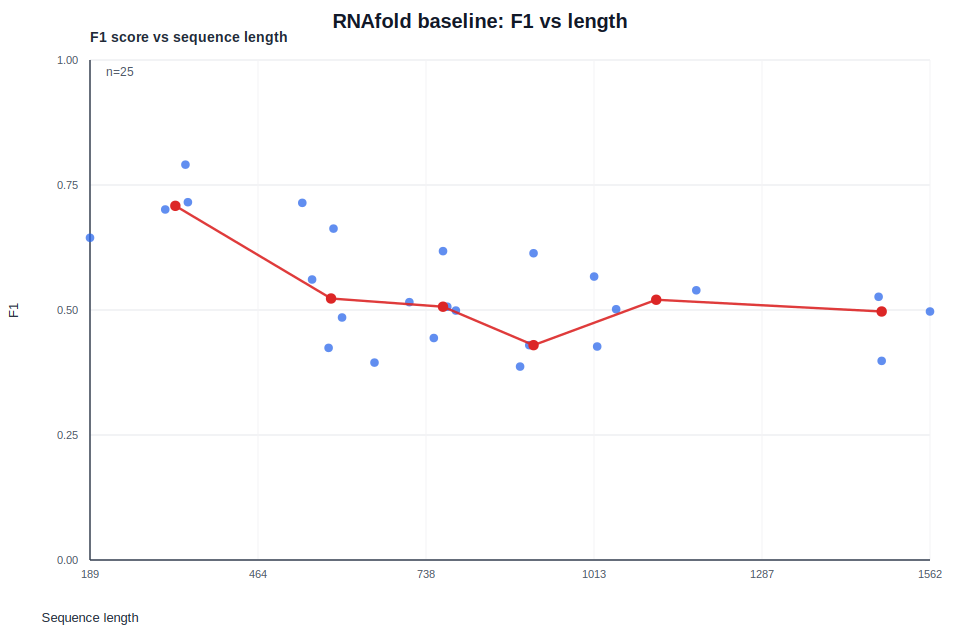
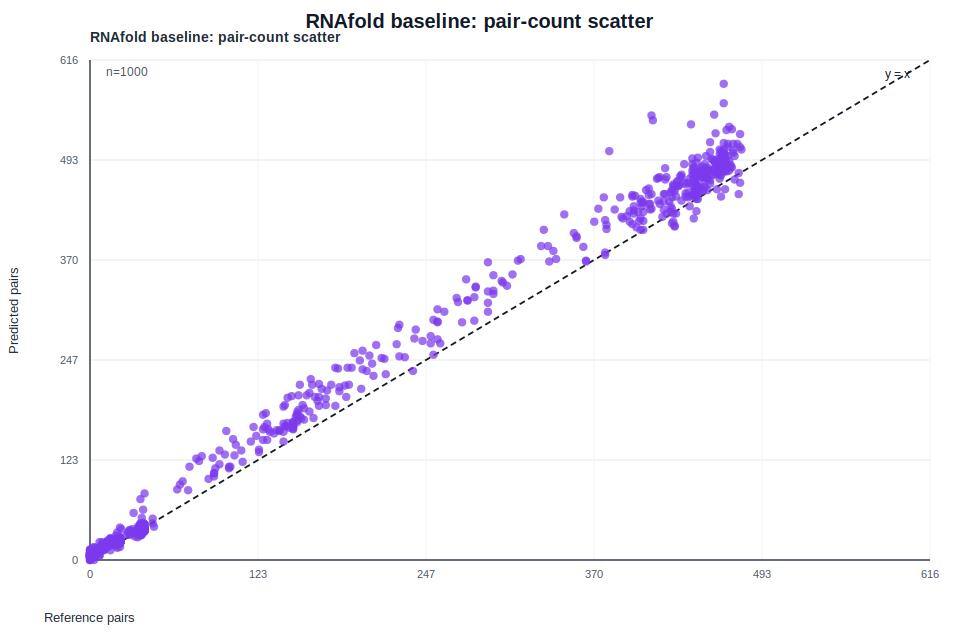
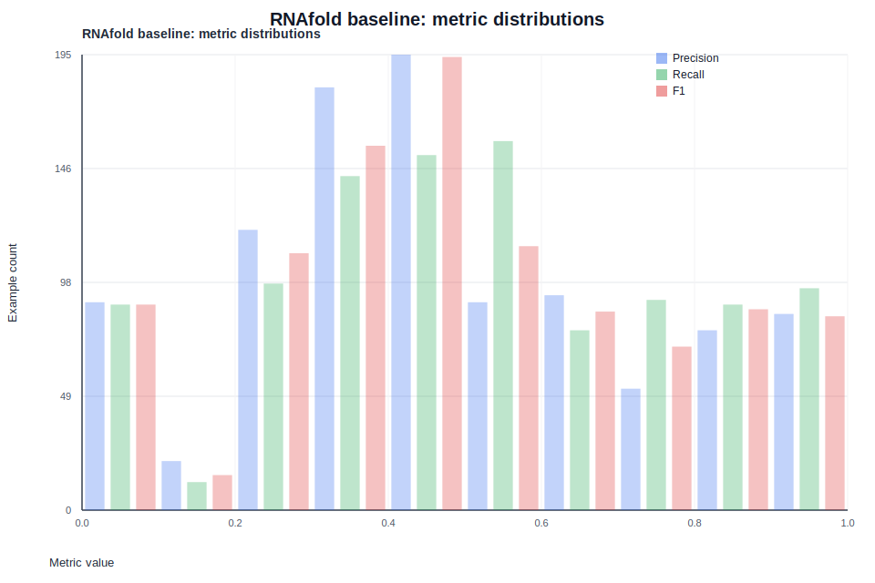
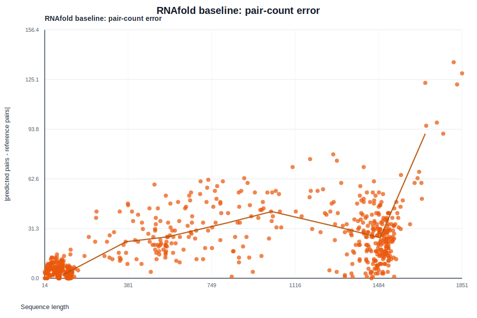

# RNA SSP

RNA SSP is a compact RNA secondary-structure toolkit for working with bpRNA examples, visualizing reference annotations, and benchmarking a ViennaRNA `RNAfold` baseline.

It is intentionally lightweight: the code is easy to read, the data flow is explicit, and the main workflows can be run directly from the repository root.

## Why This Project Exists

RNA secondary structure is one of the simplest places where biology, computation, and physical chemistry meet.

This project gives you a practical way to:

- load curated bpRNA examples
- inspect RNA sequence and structure data
- compare a thermodynamics-based baseline against reference annotations
- generate quick plots and interactive views for error analysis

If you are onboarding, the repository is designed so you can understand the whole flow in a short session rather than spelunking through a large framework.

## Highlights

- bpRNA FASTA + BPSEQ dataset loading
- conversion between BPSEQ pair maps, pair sets, and dot-bracket notation
- pair-level precision, recall, and F1 scoring
- ViennaRNA `RNAfold` baseline evaluation
- SVG/HTML error-analysis reports for baseline runs
- Tkinter-based example browser for quick inspection
- small, direct-run scripts that work well with `python -i`

## Selected Results

Here is a quick preview of the baseline analysis produced by `run_rnafold_baseline.py`.

<table>
  <tr>
    <td align="center">
      
      <br /><sub>F1 vs sequence length</sub>
    </td>
    <td align="center">
      
      <br /><sub>Predicted vs reference pair counts</sub>
    </td>
  </tr>
  <tr>
    <td align="center">
      
      <br /><sub>Metric distributions</sub>
    </td>
    <td align="center">
      
      <br /><sub>Absolute pair-count error vs length</sub>
    </td>
  </tr>
</table>

The full report is available at `scripts/prediction_plots/error_analysis_report.html`.

## Quick Start

The project is meant to be run from source. In this workspace, use the `genomics` conda environment.

```bash
source /Users/mghifary/Work/Installer/miniconda3/etc/profile.d/conda.sh
conda activate genomics
cd /Users/mghifary/Work/Code/AI/genomics
```

Run a small baseline evaluation:

```bash
PYTHONPATH=rna-ssp/src python -m rna \
  --dataset-dir rna-ssp/datasets/bpRNA_1m_90 \
  --limit 10
```

Save per-example results and error-analysis plots:

```bash
PYTHONPATH=rna-ssp/src python -m rna \
  --dataset-dir rna-ssp/datasets/bpRNA_1m_90 \
  --limit 10 \
  --output results.csv
```

## Common Workflows

### Inspect the dataset

```bash
python rna-ssp/scripts/load_bprna_examples.py \
  --dataset-dir rna-ssp/datasets/bpRNA_1m_90 \
  --limit 5
```

This is the fastest way to get a feel for the records in the dataset.

### Run the RNAfold baseline

```bash
python rna-ssp/scripts/run_rnafold_baseline.py \
  --dataset-dir rna-ssp/datasets/bpRNA_1m_90 \
  --limit 10 \
  --output results.csv
```

This will:

- predict a structure for each sequence with ViennaRNA `RNAfold`
- score each prediction against the bpRNA reference
- write a CSV file with per-example metrics
- create an SVG/HTML report directory next to the CSV by default

### Open the example viewer

```bash
python rna-ssp/scripts/visualize_bprna_examples.py \
  --dataset-dir rna-ssp/datasets/bpRNA_1m_90
```

Use this when you want a fast interactive look at example structures.

## Repository Layout

```text
rna-ssp/
  datasets/
    bpRNA_1m_90/
      bpRNA_1m_90.fasta
      bpRNA_1m_90_BPSEQLFILES/
        *.bpseq
  scripts/
    load_bprna_examples.py
    run_rnafold_baseline.py
    visualize_bprna_examples.py
  src/
    rna/
      analysis/
      cli.py
      data/
      evaluation/
      models/
      representations/
      training/
      utils/
  tests/
    test_bprna.py
```

### `datasets/`
Contains the dataset files used by the project.

- `bpRNA_1m_90/` is the expected dataset root
- `bpRNA_1m_90.fasta` stores the RNA sequences
- `bpRNA_1m_90_BPSEQLFILES/` stores the BPSEQ structure annotations

### `scripts/`
Contains small direct-run utilities for day-to-day work.

- `load_bprna_examples.py` prints readable dataset summaries
- `run_rnafold_baseline.py` runs the full ViennaRNA baseline and saves plots
- `visualize_bprna_examples.py` opens the interactive Tkinter viewer

These scripts are written to stay friendly to direct execution and interactive debugging.

### `src/rna/`
Contains the importable Python package.

#### `analysis/`
Reusable reporting and diagnostic helpers.

- `baseline_plots.py` generates the SVG/HTML error-analysis bundle

#### `data/`
Dataset parsing and in-memory data objects.

- `bprna.py` loads bpRNA examples into `RNAExample` records

#### `evaluation/`
Metric and scoring utilities.

- `metrics.py` computes pair-level precision, recall, and F1

#### `models/`
Prediction backends.

- `baseline.py` wraps ViennaRNA `RNAfold`

#### `representations/`
Representation conversion helpers.

- `pairs.py` moves between pair maps, pair sets, and dot-bracket notation

#### `training/`
Thin inference-oriented helpers kept separate for future growth.

- `infer.py` provides a convenience wrapper around the baseline predictor

#### `utils/`
Low-level I/O helpers.

- `io.py` reads FASTA and BPSEQ files

### `tests/`
Unit tests for the core data and representation paths.

- `test_bprna.py` checks parsing, alignment, and structure conversion behavior

## Data Layout

The loader expects the dataset to look like this:

```text
rna-ssp/datasets/bpRNA_1m_90/
  bpRNA_1m_90.fasta
  bpRNA_1m_90_BPSEQLFILES/
    <record_id>.bpseq
```

Records are matched by shared identifier:

- FASTA record ID
- BPSEQ filename stem

If a FASTA sequence and BPSEQ sequence do not match, the loader raises an error. If a structure cannot be represented in plain dot-bracket notation, the code keeps the pair set and leaves `dotbracket=None`.

## Requirements

- Python 3.10+
- ViennaRNA `RNAfold` available on `PATH`
- The `genomics` conda environment for this workspace

The project does not currently ship packaging metadata such as `pyproject.toml`, so use `PYTHONPATH=rna-ssp/src` when running from the repository root.

## Python API

The package exposes a small public API through `rna`.

### Load examples

```python
from rna.data import load_bprna_dataset

examples = load_bprna_dataset("rna-ssp/datasets/bpRNA_1m_90", limit=5)
```

Each `RNAExample` includes:

- `id`
- `sequence`
- `pairs`
- `dotbracket`
- `source_path`

### Convert structures

```python
from rna.representations.pairs import (
    bpseq_map_to_pairs,
    dotbracket_to_pairs,
    pairs_to_dotbracket,
)
```

- `bpseq_map_to_pairs` converts BPSEQ partner maps into canonical `(i, j)` pairs
- `pairs_to_dotbracket` validates pair geometry and emits dot-bracket notation
- `dotbracket_to_pairs` recovers pairs from a dot-bracket string

### Score predictions

```python
from rna.evaluation.metrics import pair_metrics
```

`pair_metrics(true_pairs, pred_pairs)` returns:

- `tp`
- `fp`
- `fn`
- `precision`
- `recall`
- `f1`

### Predict with RNAfold

```python
from rna.models.baseline import predict_rnafold

structure = predict_rnafold("GCAU")
```

This calls the external `RNAfold --noPS` command and returns the predicted dot-bracket structure.

## Testing

Run the test suite with:

```bash
PYTHONPATH=rna-ssp/src python -m unittest discover -s rna-ssp/tests
```

The tests focus on the foundations of the project:

- parsing aligned bpRNA data
- matching FASTA and BPSEQ sequences
- converting between structure representations
- preserving crossing-pair structures as pair sets

## Troubleshooting

- If `RNAfold` is missing, activate the `genomics` environment and verify ViennaRNA is installed there.
- If imports fail, make sure `PYTHONPATH` includes `rna-ssp/src`.
- If the dataset loader complains about missing files, confirm that `rna-ssp/datasets/bpRNA_1m_90/` contains both the FASTA file and the BPSEQ directory.
- If you want to inspect the code interactively, the scripts under `rna-ssp/scripts/` are written to work well with `python -i`.

## Contributing

This project stays small on purpose, so clarity matters more than abstraction.

- keep functions short and explicit
- reuse the existing data and representation helpers
- put reusable diagnostics in `src/rna/analysis/`
- keep scripts direct-run friendly
- align comments and docstrings with actual behavior

If you are onboarding, a good reading path is:

1. `src/rna/data/bprna.py`
2. `src/rna/models/baseline.py`
3. `scripts/run_rnafold_baseline.py`
4. `src/rna/analysis/baseline_plots.py`

Those four files show the project’s full data flow from raw dataset to prediction, scoring, and reporting.
